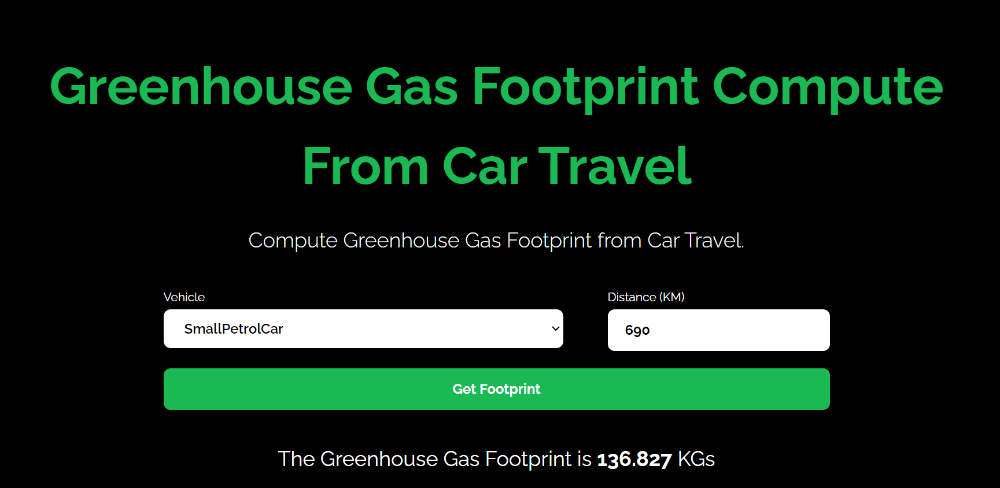

<div align="center">
	<h2>Greenhouse Gas Compute App</h2>
</div>

### ⚡️ Features

- Compute your greenhouse gas footprint from Car travel using the CarbonFootprint API.

## Guide

### 🛠️ Installation Steps

1. Download the `carbon-footprint-app` directory. Click [here](https://download-directory.github.io/?url= https://github.com/Krobert568/Greenhouse-Gas-Compute-App) to download it.

2. Unzip the downloaded file and navigate to the working directory.

```bash
cd Greenhouse-Gas-Compute-App
```

3. Install dependencies

```bash
npm install
```

4. Run the app

```bash
npm run dev
```

You are all set! Open [localhost:3000](http://localhost:3000/) to see the app.
